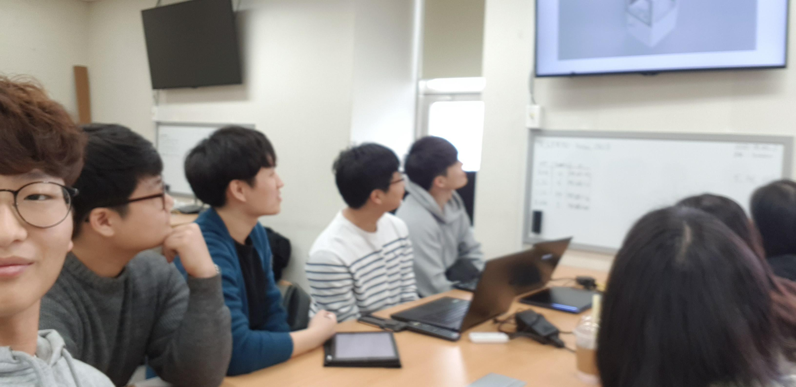

# 2020-winter

Result of researches done in 2019-2020 winter, Konkuk University.

본 프로젝트는 건국대학교 SW 가치확산 활동 중 하나로, 2020년 1월 ~ 2월 8명의 건국대학교 전기전자공학부, 전자공학과, 스마트운행체공학과 학부생이 진행한 연구 내용입니다. 새천년관 1006호에서 진행되었으며, ROS 기반 기체 활용 및 영상처리 실습에 초점을 두고 있습니다.

## 최종 연구 결과

- [산업용 카메라 오토포커싱 기술 개발](김지형/)
  - 김지형(kimjihyeong100@konkuk.ac.kr, kjhricky@gmail.com)
- [Turtlebot3 Waffle Pi와 Open Manipulator를 이용한 건물 안내로봇](강민지-권미경/)
  - 강민지(wbclair7@konkuk.ac.kr)
  - 권미경(kmk3942@konkuk.ac.kr)
- [AI를 이용한 차선 및 표지판 인식](김미선-손희원/)
  - 김미선(altjs4510@konkuk.ac.kr)
  - 손희원(dnjs99@konkuk.ac.kr)
- [TB3 Burger에 대해 SBC 업그레이드(Raspberry Pi 3B+ -> NVidia Jetson Nano)](Hyun%20Woo%20Kang/)
  - 강현우(kangdroid@konkuk.ac.kr)
- [Slam, Navigation을 통한 터틀봇 주행, OpenCV를 통한 영상 처리](최인규/)
  - 최인규(psh42458023@gmail.com)
- [OpenCV를 활용한 새천년관 출입대장 제작](안진혁/)
  - 안진혁
