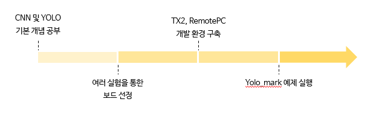

# 연구 결과 보고서
- 작성자: 김미선 (altjs4510@konkuk.ac.kr), 손희원 (dnjs99@konkuk.ac.kr)
- 작성일: 2020. 02. 26

## 개요
- 주제: AI를 이용한 차선 및 표지판 인식
- 목표: 
    - YOLO Library 활용

    - ROS를 통한 RaspberryPi3, OpenCR, RemotePC간 통신

    - 받은 정보를 사용하여 차선 및 표지판 인식

## 동계 방학 연구 결과

- 동계 방학 동안 개발 진행 상황

- 실제로 training 시킨 image 결과

## 2020 연구 계획
- 개인 맞춤형 자동차 및 스마트 홈 개발

    - Part1(영상처리) : 얼굴을 인식하여 차주인지 확인 후 현재 감정 상태 판별

    - Part2(딥러닝) : 기분에 따른 개인별 패턴 학습 후 음악 및 장소 추천

    - Part3(통신) : Web Server 구축으로 차와 스마트 홈 간 통신과 Google Cloud와 Web Server 연결로 현재 위치 및 도착 시간 파악

    - Part4(제어) : Part2, Part3 결과에 맞춰 하드웨어 제어

    - Part1,2,3,4의 데이터 통신은 ROS로 연결
